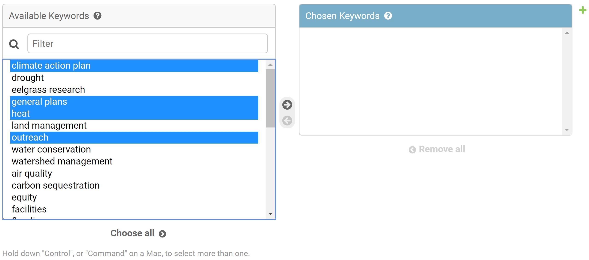

## General Information

Users can be accessed directly here: [https://api.centralcoastclimate.org/dashboard/c4Backend/user/](https://api.centralcoastclimate.org/dashboard/c4Backend/user/)

> **NOTE** When adding users, you **must not** include commas in any of the
> fields. This will cause issues when importing/exporting in bulk.

### User Type

User type signifies if the user is a university user or government/regional user.

User Type can be as follows:

|User Type|Short Name|
|---|---|
|University Faculty/Staff|`US`|
|City Staff|`CS`|
|County Staff|`CO`|
|NGO Staff|`NS`|
|Regional Staff|`RS`|

## Add Individual

To add an individual user, you must include the first name, last name,
email address, user type, keyword(s), and affiliated organization(s). All other
fields are optional but recommended.

The email address field is used to uniquely identify users, so make sure this
is unique among the various users in the system.

### Adding Many-To-Many Items

To add many-to-many items such as keywords, collaborations, and organizations,
follow the instructions as outlined below.

You may use `Shift` to select many entries in a row, or `Ctrl`/`Cmd` to select
multiple entries.

If you wish to add a new linked item (Many-To-Many fields such as Keywords,
Collaborations, and Organizations are included in this) you may click the green
plus button (see picture above) to add a new item without leaving the current
page.

## Add Bulk

For information on using the bulk uploader, please reference
[how to import](importing-data.md). Explained below is some unique information
required to import users.

When importing users, the system requests the following information:

|First Name|Last Name|Email Address|Website|Job Title|Organization|User Type|Description|Keywords|Collaborations|ID|
|----------|---------|-------------|-------|---------|------------|---------|-----------|--------|--------------|--|
|Required|Required|Required|Optional|Optional|Required|Required|Optional|Required|Optional|Do not include|

When importing data, omit the `ID` row.

When uploading users in bulk, you must use the short name as the field
value for `User Type`.
For reference, use the values as described in [User Type](#user-type).

To add a keyword or collaboration, you must type the name exactly as it appears
in the name field (`Keyword Name` or `Collaboration Name`).

To add an organization, you must type the name exactly as it appears in the
unique name field (`ORGNAMEUNIQUE`).

To add multiple organizations, collaborations, or keywords, you must comma
separate them.

A template excel file for data entry can be found [here](assets/templates/UserBlankTemplate.xlsx)
