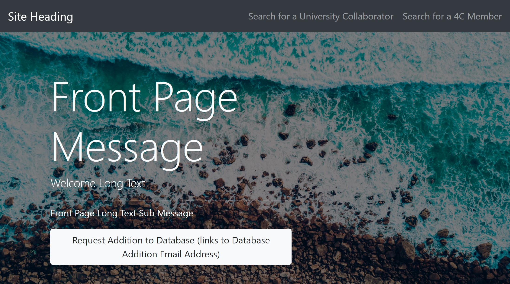

## General Overview

There can only be one front end parameters object. If you attempt to make more
than one, only the first one will be saved.

The following information is editable from [api.centralcoastclimate.org](https://api.centralcoastclimate.org/dashboard/c4Backend/frontendparameters/1/).

* Site Heading
* Front Page Message
* Welcome Long Text
* Front Page Long Text Sub Message
* Database Addition Email Address

