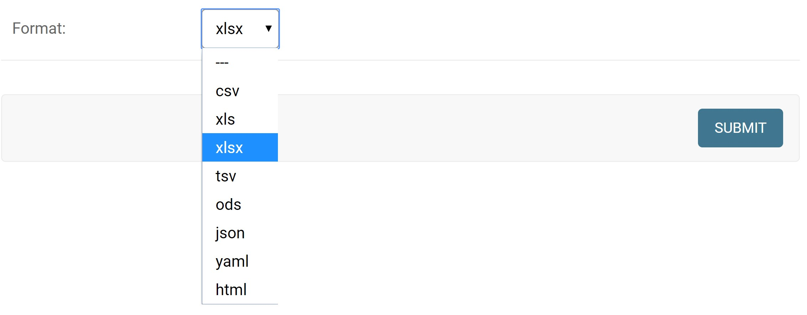
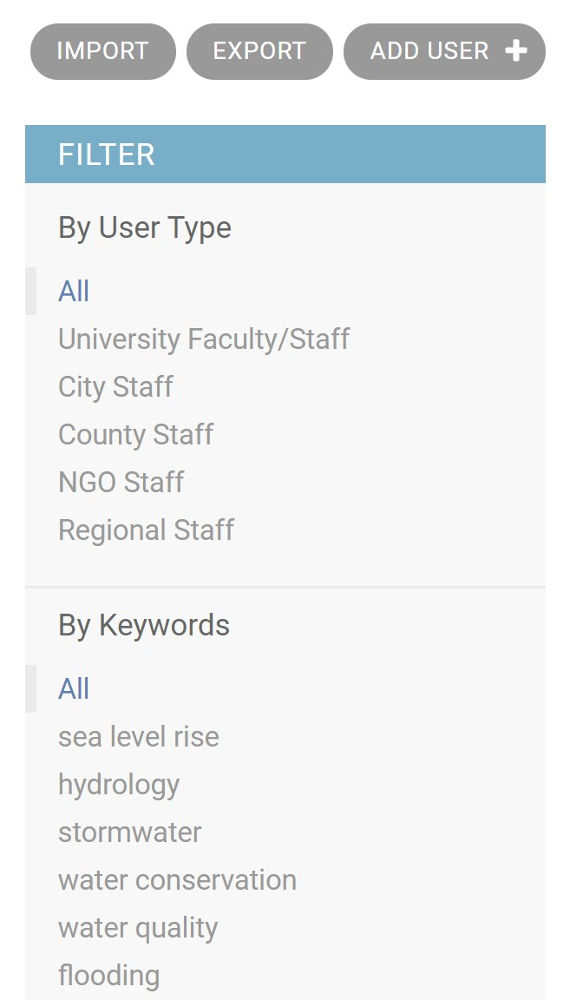

## General Overview

To export data, select the `Export` button found in the upper right of any of
the `C4BACKEND` entries:

<!--  -->

* Collaborations
* Keywords
* Organizations
* Users

To export data, select the output file type, and click export.

If you wish to export a filtered subset of data, you can use the filters on the
main data screen. Shown below is an example of the filter options. After
filtering, selecting the export button will automatically apply that filter to
the exported data.

<!--  -->

<!-- Mention about filtering... -->
