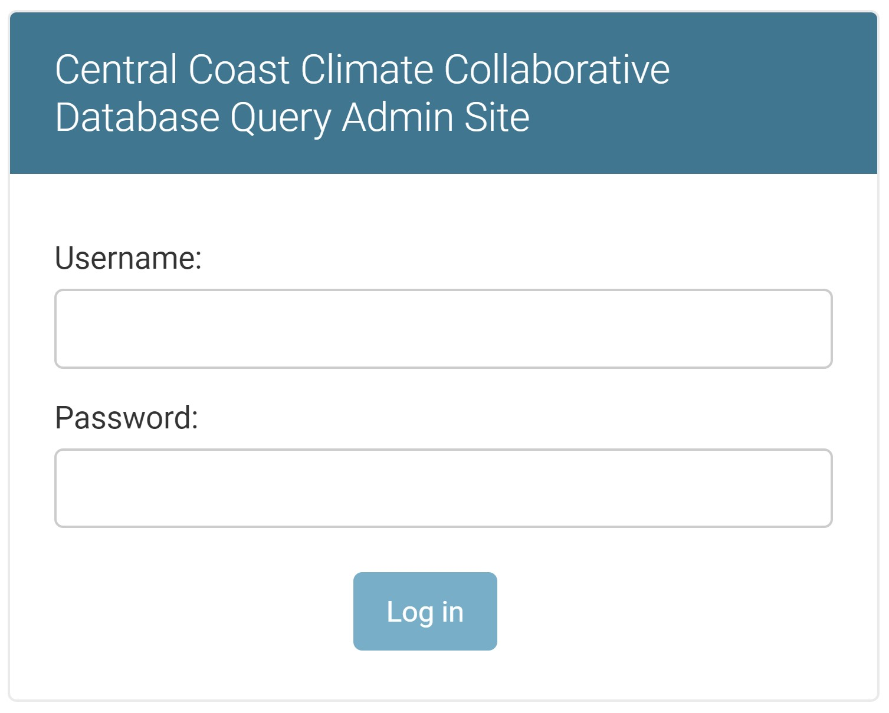

To access the backend website, you must login through
[api.centralcoastclimate.org/dashboard](https://api.centralcoastclimate.org/dashboard)
If you forget the `/dashboard` part of the URL, you will get a `404` error.

Once you are at the login screen, login with the username and password provided
to you.

After logging in, you will see the site administration dashboard. 
