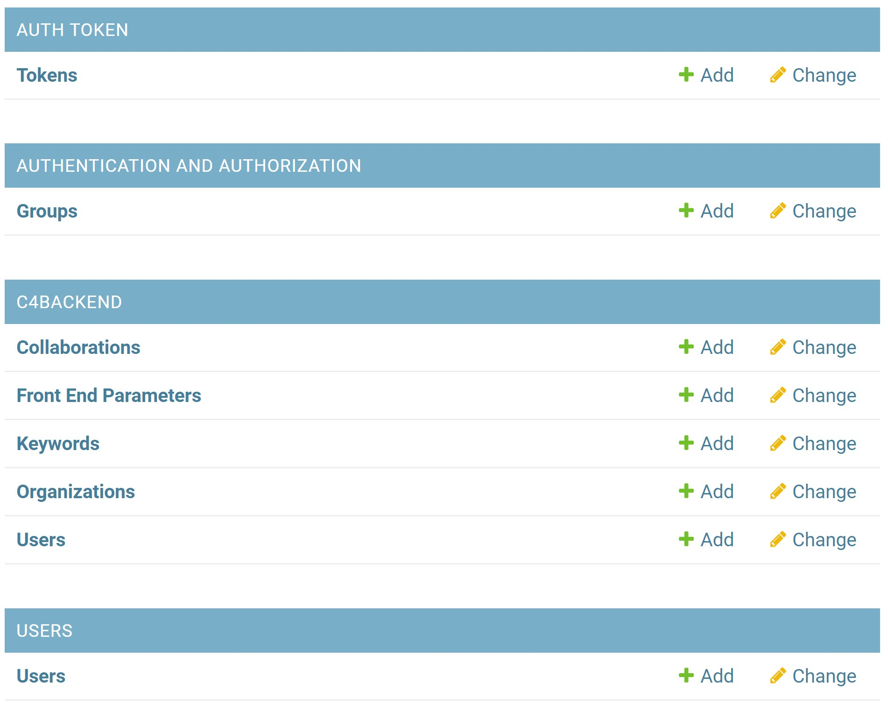
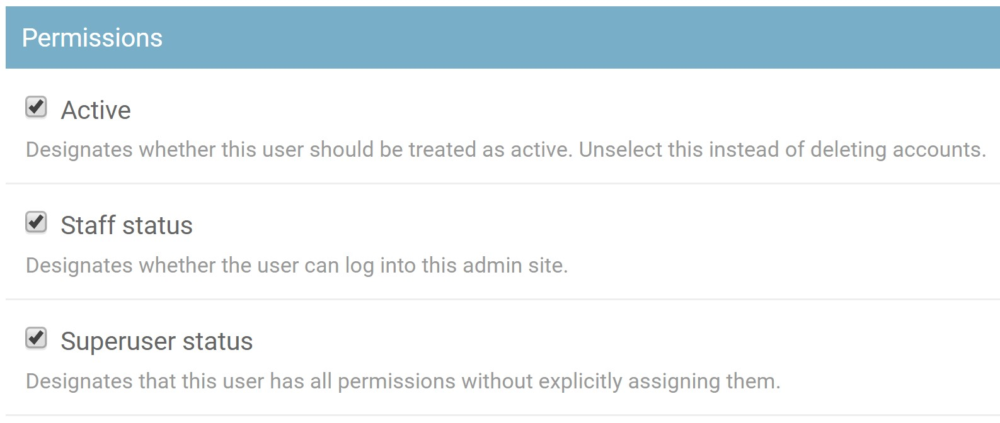

## Using this website

This website provides all documentation required to administer the backend API
for the central coast climate collaborative universities website.

You can navigate between different pages on this website using the links at the
left (in desktop mode) or the burger menu (in smartphone mode).

While using this website, if you find documentation that should be updated, you
may use the `Edit` button found in the top right of every page to edit the
contents of that page. Please submit a pull request on GitHub and, if you change
if accepted, it will be merged and the website will be updated.

## Logging In

To access the backend website, you must login through
[api.centralcoastclimate.org/dashboard](https://api.centralcoastclimate.org/dashboard)
If you forget the `/dashboard` part of the URL, you will get a `404` error.

Once you are at the login screen, login with the username and password provided
to you.
<!--  -->

## Using the Dashboard

After logging in, you will see the site administration dashboard.

The dashboard is broken up into four different sections:

* AUTH TOKEN
* AUTHENTICATION AND AUTHORIZATION
* **C4BACKEND**
* **USERS**

The **bolded** items are the only ones that are of great importance. These two
items will be discussed in more detail below.

### C4 Backend

The C4BACKEND area is where you can administer the C4 users, collaborations,
organizations, keywords, and front end parameters.

You can also access this area directly by visiting:
[https://api.centralcoastclimate.org/dashboard/c4Backend/](https://api.centralcoastclimate.org/dashboard/c4Backend/)

### Users
You can add new site administration users here.
> **NOTE** These users are for using and accessing
> [api.centralcoastclimate.org](https://api.centralcoastclimate.org/dashboard).
> These users should not be confused with the central coast members/users in
> `C4BACKEND\USERS`

To edit a user account, select `USERS\Users` and select a user account to
modify. If you wish to create a new user account, select `USERS\Users` and then
click the
[`ADD USER`](https://api.centralcoastclimate.org/dashboard/users/customuser/add/)
button in the top right corner. After entering the details for a new user, you
will be redirected to the user edit page. Make sure that you add an email
address (it can be fictitious, but it needs to be there - it's a small bug in
the system.)

Make sure to set the permissions appropriately.
