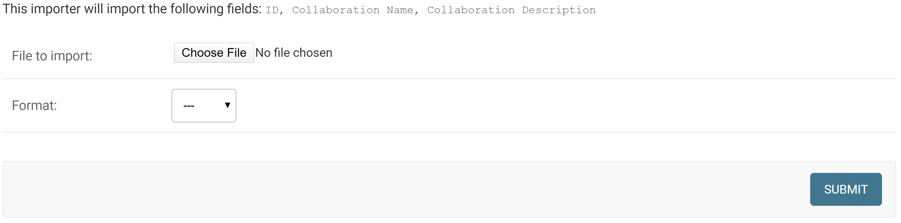
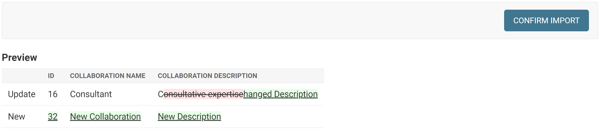

## General Overview

To import data, select the `Import` button found in the upper right of any of
the `C4BACKEND` entries:

<!--  -->

* Collaborations
* Keywords
* Organizations
* Users

> You'll note that `Front End Parameters` are excluded from this list. These
> parameters cannot be imported or exported.

When you reach the import screen, you will see the following image. For this
example, the `collaborations` import options are shown.

When importing the data, the headers must be formatted **exactly** as the
description shows. In this case, the headers must be (`ID` and if shown,
`dateAdded`can be omitted). For example, trying to input the following data will
show the confirmation screen shown below.
|Collaboration Name|Collaboration Description|
|---|---|
|Class projects|Opportunities for class projects|
|Consultant|Changed Description|
|New Collaboration|New Description|

You can notice how `Class Projects` was already in the database and thus was not
shown in the entry import list. Any new items are denoted by the `new` tag and
the information is shown in green in the import list. Updated information is
denoted with a red strikethrough of the old information and green highlighted
text of the new information.
